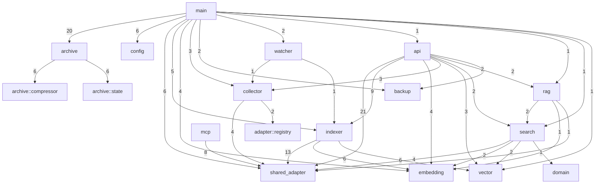

This document describes Memex's internal architecture, auto-generated from source code analysis.

## Module Overview

Memex is organized into the following modules:

| Module | Responsibility |
|--------|----------------|
| `main` | Entry point, CLI, scheduler setup |
| `api` | HTTP REST API (Axum) |
| `shared_adapter` | SQLite database access layer |
| `indexer` | Vector embedding and indexing |
| `embedding` | Ollama integration for embeddings |
| `vector` | LanceDB vector storage |
| `search` | Full-text + semantic search |
| `rag` | RAG-based Q&A |
| `collector` | JSONL session parsing |
| `archive` | Incremental backup & compression |
| `mcp` | MCP server protocol |
| `watcher` | File system monitoring |

## Module Dependencies



Edge labels indicate the number of cross-module function calls.

## Key Insights

### Central Dependencies

**`shared_adapter`** is the most depended-upon module:
- `api` calls it 21 times
- `indexer` calls it 13 times
- `mcp` calls it 8 times

This is the SQLite database abstraction layer - all data persistence flows through it.

### Data Flow

```
                    ┌─────────────┐
                    │   watcher   │ (file changes)
                    └──────┬──────┘
                           ↓
┌─────────────┐     ┌─────────────┐
│  collector  │ ←── │    main     │ (scheduled)
└──────┬──────┘     └─────────────┘
       ↓
┌─────────────┐     ┌─────────────┐
│shared_adapter│ ←── │   indexer   │
└──────┬──────┘     └──────┬──────┘
       │                   ↓
       │            ┌─────────────┐
       │            │  embedding  │ → Ollama
       │            └──────┬──────┘
       │                   ↓
       │            ┌─────────────┐
       └──────────→ │   vector    │ → LanceDB
                    └─────────────┘
```

### API Layer

The `api` module is the HTTP interface, coordinating:
- `indexer` for embedding operations
- `search` for queries
- `rag` for Q&A
- `mcp` for MCP protocol

## Scheduler Tasks

The `main` module sets up periodic tasks:

| Task | Frequency | Modules Involved |
|------|-----------|------------------|
| `collect_all` | 30s | collector → shared_adapter |
| `index_pending` | 60s | indexer → embedding → vector |
| `backup` | daily | backup |
| `check_and_archive_all` | hourly | archive → compressor |
| `compact` | daily | vector |

See [Scheduler Internals](/docs/memex/internals/scheduler) for detailed call trees.

---

*Auto-generated using [iris](https://github.com/vimo-ai/iris) architecture analysis.*
